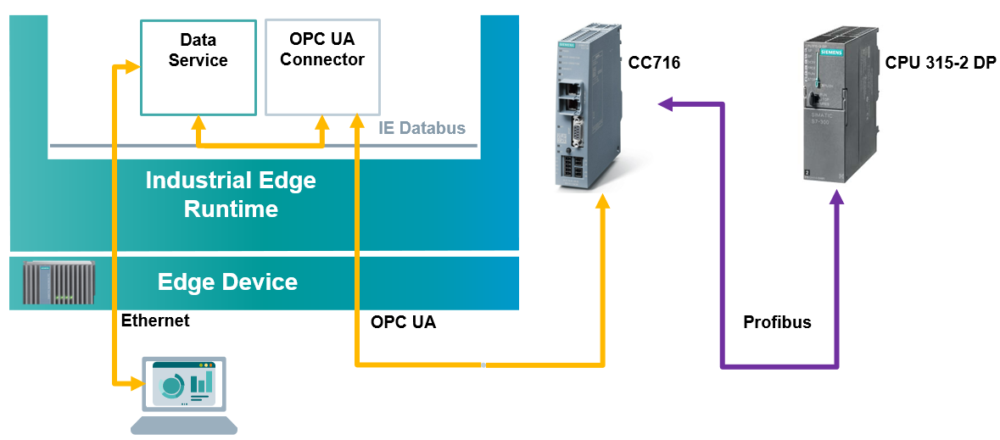

# Industrial Edge Profibus connection with CC716 getting started

Below you can find the structure of this IE how-to:

- [Industrial Edge PROFIBUS connection with CC716 Getting Started](#industrial-edge-profibus-connection-with-cc716-getting-started)
  - [Description](#description)
    - [Overview](#overview)
    - [General Task](#general-task)
  - [Requirements](#requirements)
    - [Prerequisites](#prerequisites)
    - [Used components](#used-components)
  - [Installation](#installation)
  - [Usage](#usage)
  - [Documentation](#documentation)
  - [Contribution](#contribution)
  - [License and Legal Information](#license-and-legal-information)

## Description

### Overview
### General Task

The aim of this how-to is to connect a PROFIBUS device to an Industrial Edge Device (IED). This is done with the help of an Industrial IoT gateway that is called [SIMATIC Cloud Connect 716](https://support.industry.siemens.com/cs/document/109767960). The advantage of using the CC716 is that nothing needs to be changed in the existing TIA project to use it, you can just plug it into your existing Profibus Network.

## Requirements

### Prerequisites

- General understanding of PROFIBUS
- Knowledge of working with IE Databus
- Knowledge of working with OPC UA Connector

### Used components

* Industrial Edge Device IPC227E V1.8.0-6
* SIMATIC CC716 FW V1.9
* IE Databus V1.7.1
* OPC UA Connector V1.8.0-14
* IE Flow Creator V1.3.9
* TIA Portal V17
* PLC: CPU 315-2 DP FW 2.6

## Installation

The neccessary set up steps are explained in following doc: [configuration of CC716 & OPC UA Connector](docs/Installation.md)

## Usage

Refer to the [manual of OPC UA Connector](https://support.industry.siemens.com/cs/document/109811051) for information on how to read and write the configured tags. Other apps can consume the PLC data from the ie-databus.

As soon as the OPC UA Connector is configured, data can be transfered.

You can find further information about how to handle the data via the IE Flow Creator in the [Usage](/docs/Usage.md) documentation:

* [Read metadata](/docs/Usage.md#read-metadata)
* [Write data](/docs/Usage.md#write-data)
* [Read data](/docs/Usage.md#read-data)
* [Use Data Service](/docs/Usage.md#use-data-service)

## Documentation

You can find further documentation and help in the following links

* [Industrial Edge Hub](https://iehub.eu1.edge.siemens.cloud/#/documentation)
* [Industrial Edge Forum](https://www.siemens.com/industrial-edge-forum)
* [Industrial Edge landing page](https://new.siemens.com/global/en/products/automation/topic-areas/industrial-edge/simatic-edge.html)
* [Industrial Edge GitHub page](https://github.com/industrial-edge)
* [SIMATIC CC716 documentation](https://support.industry.siemens.com/cs/document/109767960)
* [OPC UA Connector documentation](https://support.industry.siemens.com/cs/document/109811051)

## Contribution

Thank you for your interest in contributing. Anybody is free to report bugs, unclear documentation, and other problems regarding this repository in the Issues section.
Additionally everybody is free to propose any changes to this repository using Pull Requests.

If you haven't previously signed the [Siemens Contributor License Agreement](https://cla-assistant.io/industrial-edge/) (CLA), the system will automatically prompt you to do so when you submit your Pull Request. This can be conveniently done through the CLA Assistant's online platform. Once the CLA is signed, your Pull Request will automatically be cleared and made ready for merging if all other test stages succeed.

## License and Legal Information

Please read the [Legal information](LICENSE.md).
