# Installation

- [Installation](#installation)
  - [CC716 configuration](#cc716-configuration)
    - [PROFIBUS connection - Interface configuration](#profibus-connection---interface-configuration)
    - [Process access](#process-access)
    - [OPC UA server - Configuration](#opc-ua-server---onfiguration)
    - [Data points](#data-points)
    - [Apply changes](#apply-changes)
  - [Industrial Edge Device configuration](#industrial-edge-device-configuration)
    - [Configuring OPC UA connector](#configuring-opc-ua-connector)
    
Next steps are needed to make data from PROFIBUS device available for Industrial Edge apps. 
First, configure CC716 to read required data from PROFIBUS device. Then, enable OPC UA Server on CC716 and map the data. Next, use IE OPC UA Connector to retrieve data. Then, OPC UA Connector will push data to IE Databus from where data will be available to other IE applications installed on same IE device.

## CC716 configuration
For the first set up of the SIMATIC CC716 please take a look at following manual: [SIMATIC CC716 Manual](https://support.industry.siemens.com/cs/document/109767960). In chapter "6.3.1 Establishing a connection to the WBM" the predefined IPv4 address and default credentials are stated. This needs to be changed after successful log in. 

Note that CC716 has two interfaces: 
 - Process interface (P2) - for accessing CC716 configuration and configuring Web Based Management and for connecting to subnet of process stations. This network is considered as an internal and protected network.
 - Cloud interface (P1) - for connecting to Internet or external network where OPC UA clients are located. This network is considered unprotected and it needs to be separated by firewall.
 
Scope of this how-to is to connect P2 interface of the CC716 to Profibus device (MPI/DP interface) and then IED to P1 (OPC UA) of CC716.

### PROFIBUS connection - Interface configuration

Once the initial setup is finished, navigate to the Interface configuration and select PROFIBUS/MPI
- Configure a free PROFIBUS address (needs to be unique)
- enable the Automatic configuration check box, or disable it if you want to configure the PROFIBUS connection parameters manually
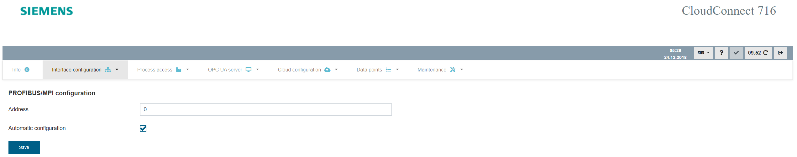

### Process access

The next step is to configure the Process access:

- Select S7/Modbus station
- Enter a station name and click Add
- Select the new station in the "Station configuration" section
- Change the protocol to S7 PROFIBUS/MPI
- Save

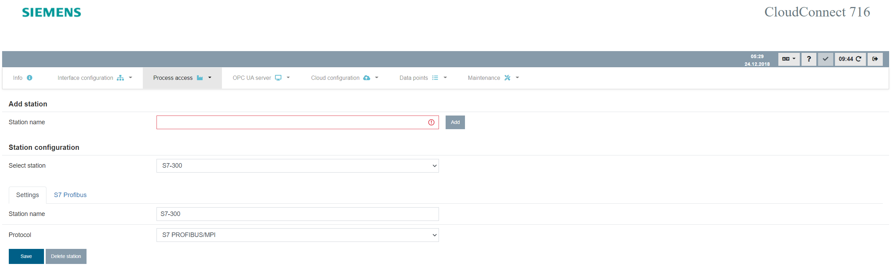

- Navigate to the S7 Profibus tab
- Enter the PROFIBUS/MPI address of your PROFIBUS device, int the TIA example address 2 was configured for the PLC
- Select the Controller family
- Use Standard TSAPs or configure them according to your device
- Define the polling cycle
- Save

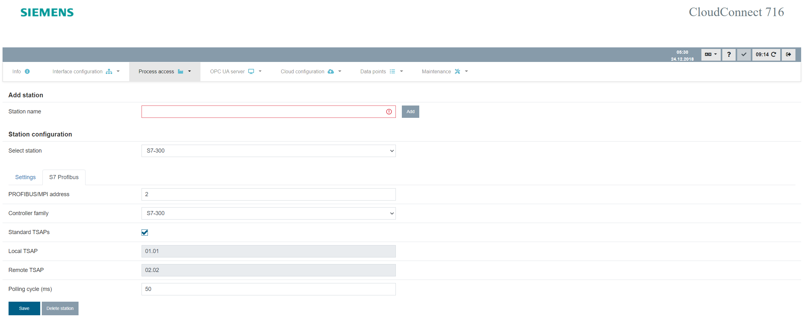

### OPC UA server - Configuration
Navigate to OPC UA server -> Configuration 

- Select Enable OPC UA server
- The Server address is based on the configuration of the ethernet interface P1 of the CC716
- Customize OPC UA server settings based on your requirements or use the default values

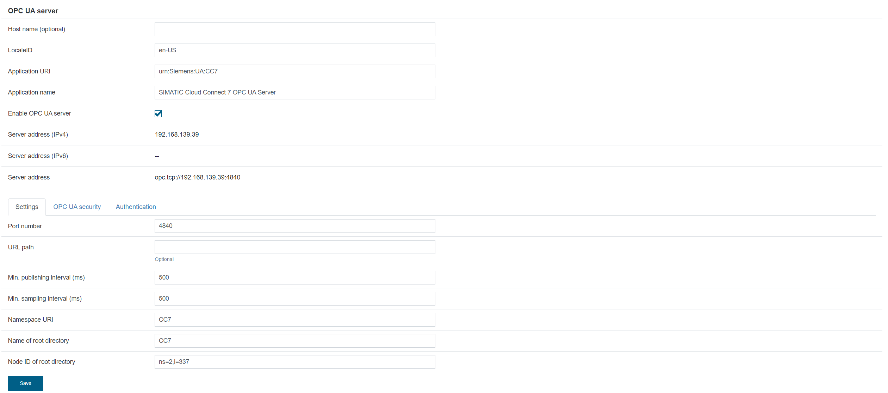

Go to the OPC UA security tab. For this how-to no security policy is used. This is NOT recommended for production use and is only done, to keep this how-to compact.

- Select "Use self-signed certificate" or upload your own
- Select "None (not recommended)" as Security Policy
- Select "No certificate validation" in the Trusted clients section
- Save

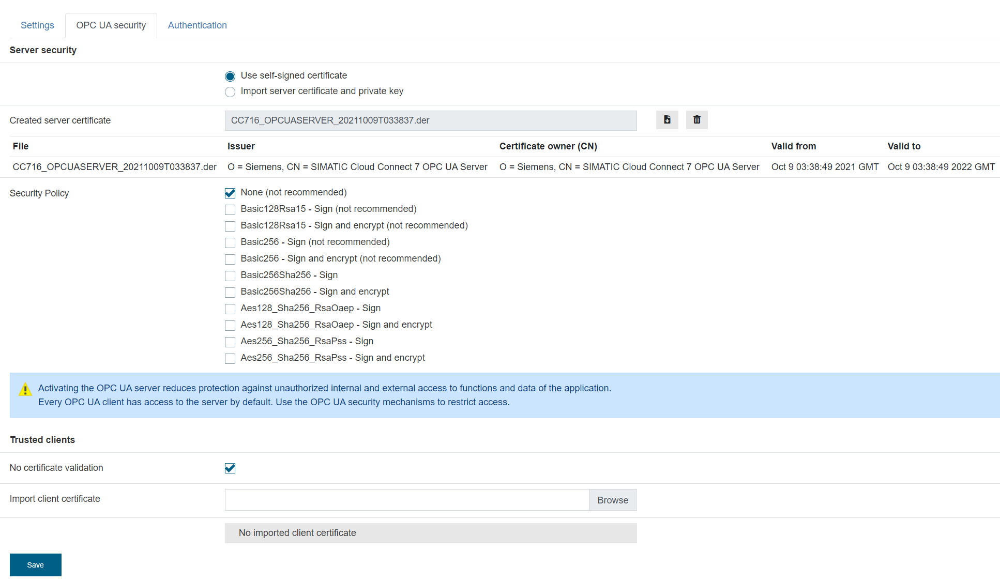

Navigate to Authentication tab. For this how-to anonymous access is used. This is NOT recommended for production use and is only done, to keep this how-to compact.
- Select "Enable anonymous access"
- Save

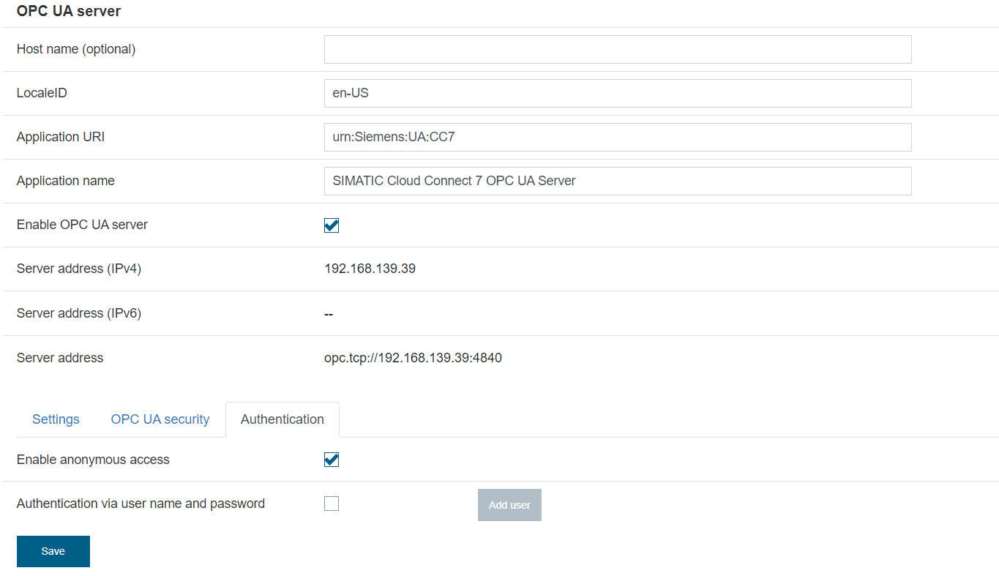

### Data points
Data points can be added manually by providing the address and data type of each data point inside the S7 project. The second option is to export the data points from the TIA project and use the "Import variables" functionality of the CC716, see chapter "6.9.3 Import variables" of the CC716 manual. For this how-to the import functionality is used for DBs, for other options please take a look at the manual.

- Open the [TIA project](../src/Profibus_Edge_HowTo.zap17) located in the TIA Portal
- Download the project to your PLC
- Select the desired DB inside the project
- Right click -> Generate source from blocks -> Selected blocks only
- Save the file

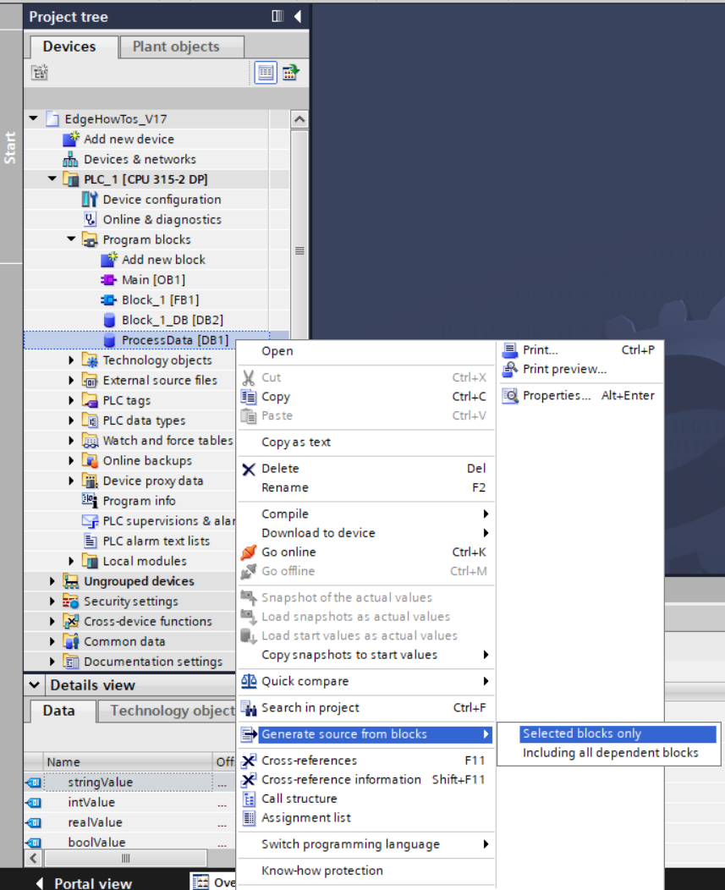

Navigate to the WBM of the CC716 and select Data points -> Import variables
- Select your previously created station
- Browse the Source file which you exported from the TIA Portal project
- Click Import source file

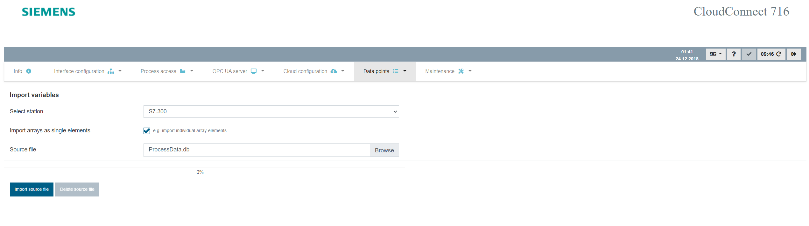

After the successful import of the source file you have to manually enter the DB number of the corresponding Data block. For this tutorial DB1 was exported from the TIA Portal project so DB number is set to 1. 
- DB number = 1
- Save
- Select all imported datapoints
- Import all

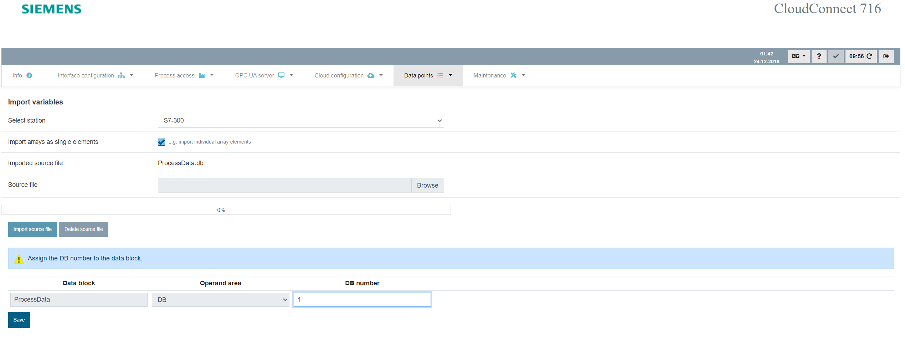

Navigate to Data points -> Data points. You can see the newly imported data points and their configruation. The target section is empty.

- Click on Multi-editing button
- Select Target check box
- Choose OPC as Target
- Select Access check box 
- Choose Read/Write (if you do not want to be able to write data back to the PLC select Read)
- Click on the "Set for all" button
- Click save

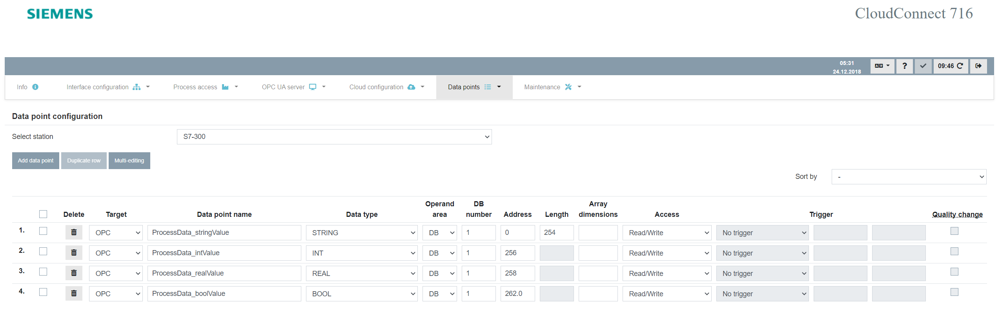

### Apply changes
Click on the apply changes or Deploy button in the top right corner of the WBM. This will load the current configuration of the CC716 into it's runtime and enable OPC UA clients to connect to it.

## Industrial Edge Device configuration

### Configuring OPC UA connector
Navigate to the Data Connections section in your Industrial Edge Managment (IEM) and launch the OPC UA Connector configurator. The manual for the OPC UA Connector can be found [here](https://support.industry.siemens.com/cs/document/109811051). Select the IED which you connected to the CC716.
- Check the Databus configuration first and configure the Databus credentials inside the OPC UA Connector configurator
- Add Data Source
- Enter your PLC name e.g. CC716
- enter the OPC-UA URL which you configured for the CC716 (you can look it up in the OPC UA server configuration in the CC716 WBM)
- Use port 4840 if you did not change it to a different one
- Messaging Mode None (if you used a security policy in the OPC UA server settings select it here)
- Authentication Mode Anonymous (if you set up a user in the CC716 enter the credentials)
- Add

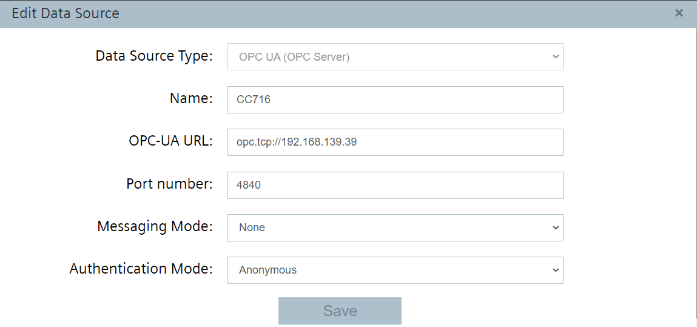

- Browse tags
- Select the tags you want to use on your IED
- Choose Acquisition Cycle and desired Access Mode
- Add Tags

Alternatively you can import the [OPC UA configuration](../src/OPC_UA_config.json) and change the IP address of the connection to the address of your CC716.

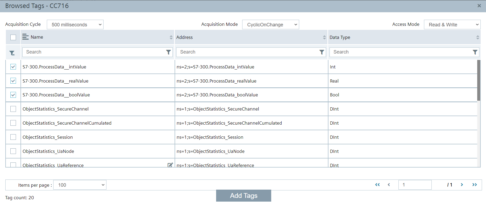

- Deploy
- Start Project

